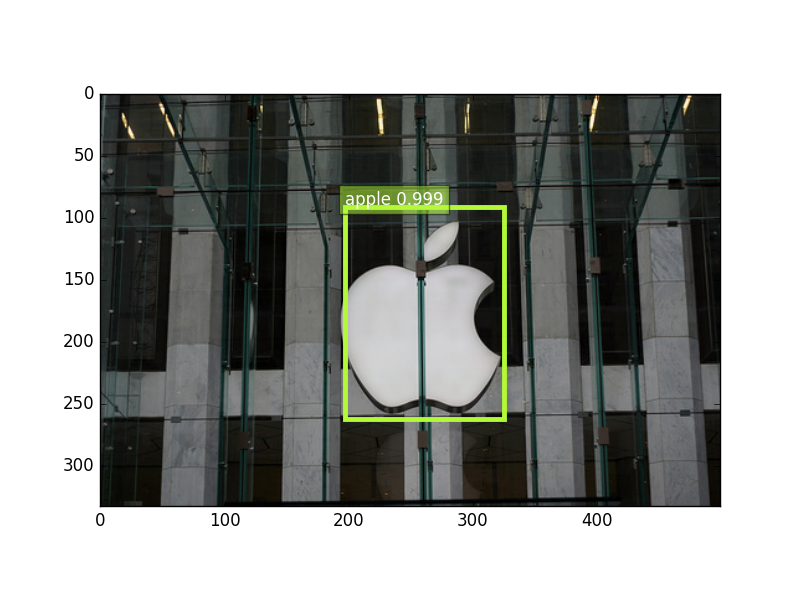
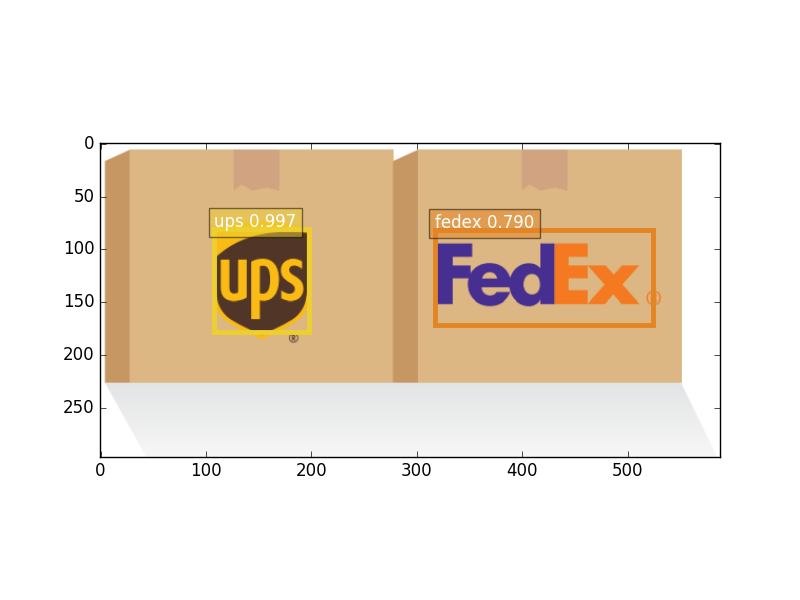
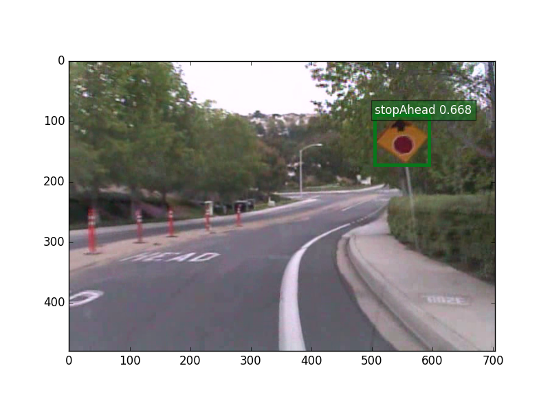

# SSD: Single Shot MultiBox Object Detector

SSD is an unified framework for object detection with a single network.

This is an implementation for the final course project of image preprocessing.

Our implementation is based on the  ssd exmaple in mxnet, we modify some code to use our algorithms.

You can use the code to train/evaluate/test for sign detection task.

### Disclaimer
This is a re-implementation of original SSD which is based on caffe. The official
repository is available [here](https://github.com/weiliu89/caffe/tree/ssd).
The arXiv paper is available [here](http://arxiv.org/abs/1512.02325).

This example is intended for reproducing the nice detector while fully utilize the
remarkable traits of MXNet.
* The model is fully compatible with caffe version.

Here are some results on images from internet.
### Demo results




### mAP
|        Model          | Training data    | Test data |  mAP |
|:-----------------:|:----------------:|:---------:|:----:|
| VGG16_reduced 300x300 | VOC07+12 trainval| VOC07 test| 71.57|

### Speed
|         Model         |   GPU            | CUDNN | Batch-size | FPS* |
|:---------------------:|:----------------:|:-----:|:----------:|:----:|
| VGG16_reduced 300x300 | TITAN X(Maxwell) | v5.1  |     16     | 95   |
| VGG16_reduced 300x300 | TITAN X(Maxwell) | v5.1  |     8      | 95   |
| VGG16_reduced 300x300 | TITAN X(Maxwell) | v5.1  |     1      | 64   |
| VGG16_reduced 300x300 | TITAN X(Maxwell) |  N/A  |     8      | 36   |
| VGG16_reduced 300x300 | TITAN X(Maxwell) |  N/A  |     1      | 28   |
- *Forward time only, data loading and drawing excluded.*


### Getting started
* You will need python modules: `easydict`, `cv2`, `matplotlib` and `numpy`.
You can install them via pip or package managers, such as `apt-get`:
```
sudo apt-get install python-opencv python-matplotlib python-numpy
sudo pip install easydict
```

* Build MXNet: Follow the official instructions
```
# for Ubuntu/Debian
cp make/config.mk ./config.mk
```
Remember to enable CUDA if you want to be able to train, since CPU training is
insanely slow. Using CUDNN is optional.
### Train the model
This example only covers training on sign dataset. Other datasets should
be easily supported by adding subclass derived from class `Imdb` in `dataset/imdb.py`.
See example of `dataset/pascal_voc.py` for details.
#### Train from scratch

* By default, this example will use `batch-size=32` and `learning_rate=0.001`.
You might need to change the parameters a bit if you have different configurations.
Check `python train.py --help` for more training options. For example, if you have 2 GPUs, use:
```
# note that a perfect training parameter set is yet to be discovered for multi-GPUs
python train.py --dataset=sign --network=vgg16_reduced --resume=-1  --finetune=0 --pretrained=''  --prefix=model/ssd300_vgg16_5_mobile  --batch-size=20 --gpus=0
 ```
* Memory usage: MXNet is very memory efficient, training on `VGG16_reduced` model with `batch-size` 32 takes around 4684MB without CUDNN.
* Initial lenarning rate: 0.001 is fine for single GPU. 0.0001 should be used for the first couple of epoches then go back to 0.001 via using parameter --resume.

### Evalute trained model
Again, currently we only support evaluation on PASCAL VOC
Use:
```
# cd /path/to/mxnet/example/ssd
python evaluate.py --gpus 0,1 --batch-size 128 --epoch 0
```
### Convert model to deploy mode
This simply removes all loss layers, and attach a layer for merging results and non-maximum suppression.
Useful when loading python symbol is not available.
```
# cd /path/to/mxnet/example/ssd
python deploy.py --num-class 20
```
